# Schoolio
### an application for parsing and rendering data related to U.S High Schools

#### Homepage
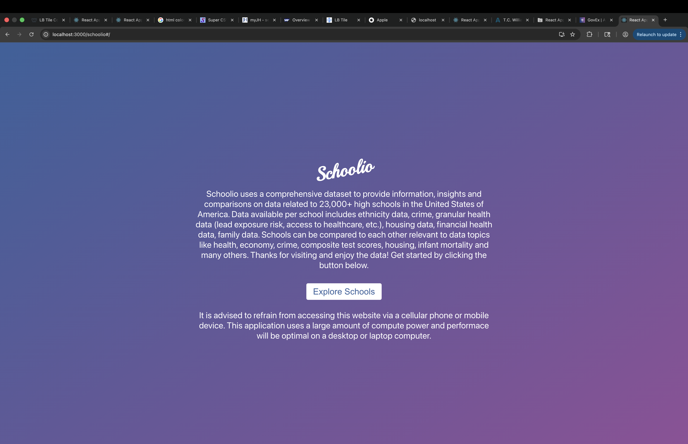

#### Find Schools
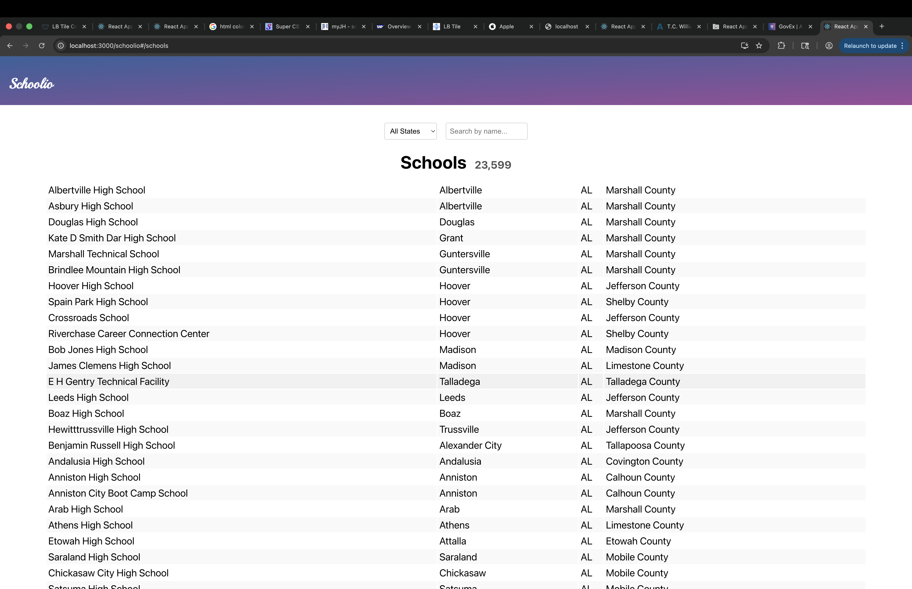

#### View data for an individual school
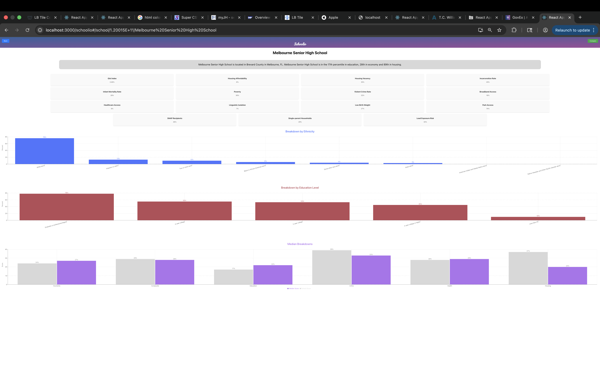

#### Compare data between two schools
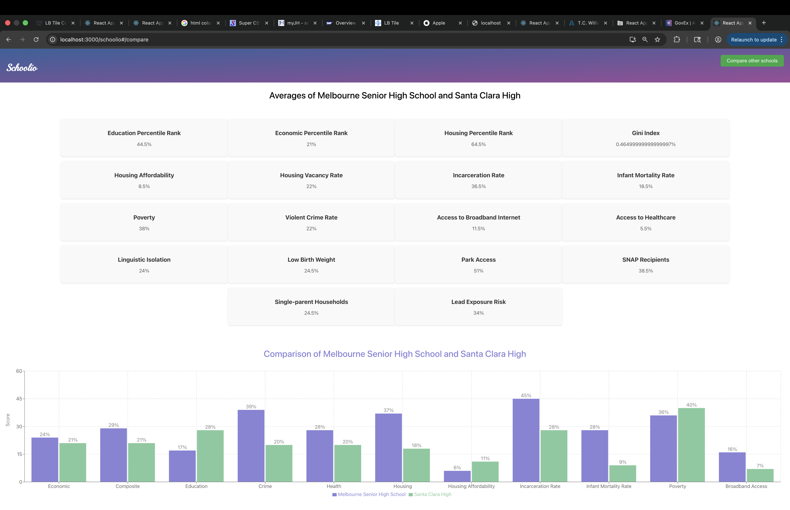

## AI tooling and usage:
### Throughout development of this application, I leveraged the power of Copilot's chat tool to answer questions, fix bugs, etc related to the application. See screenshots below for reference:

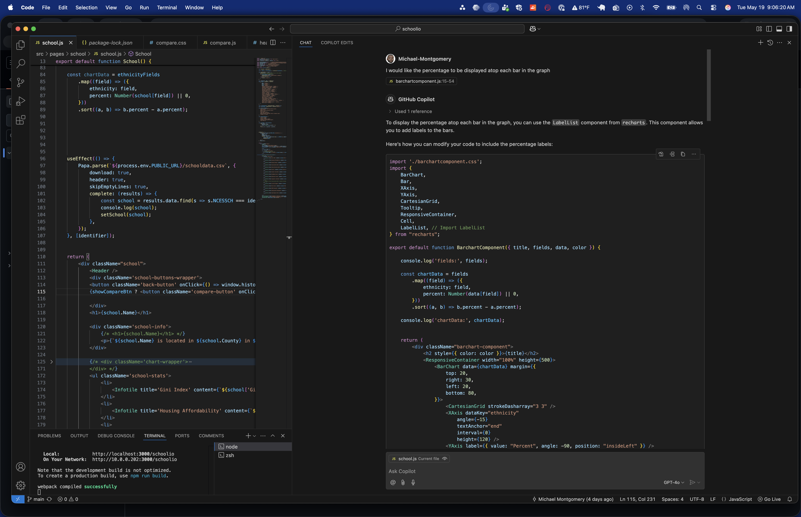
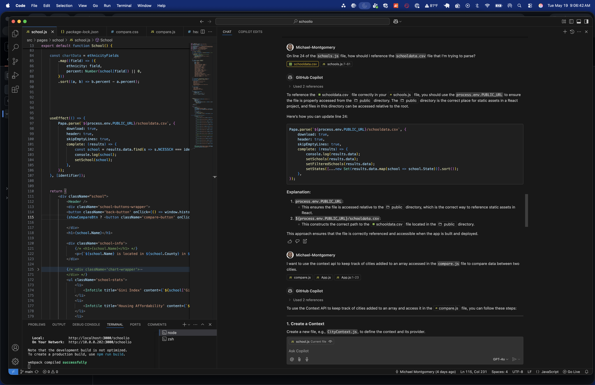
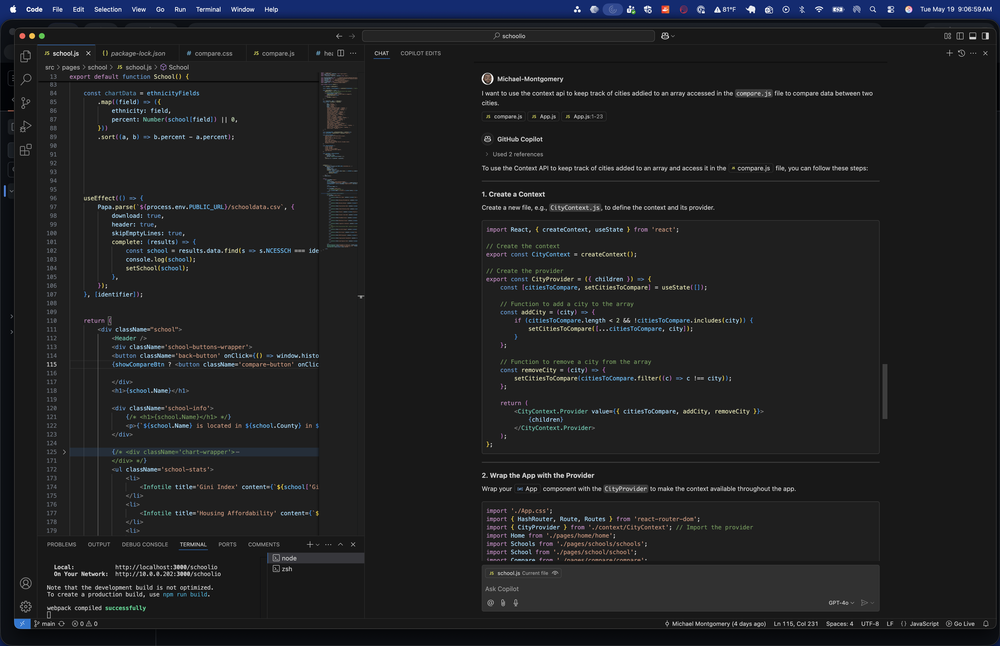


## My experience using AI in this application

```
AI tooling was helpful throughout development, by way of auto-completion, chat and bug resolution assistance, etc. In this instance, AI undoubtedly increased production speed and in some cases, code quality. While I am weary of letting AI fully take the reigns, I will continue to lean into it and learn more about agents, best practices. Future development for this application might include an AI summary of school data.

```


# Futher Conclusion on AI

The following is an interaction where I asked AI to create a simple React to-do application with minimal interference from me. Here are the results:

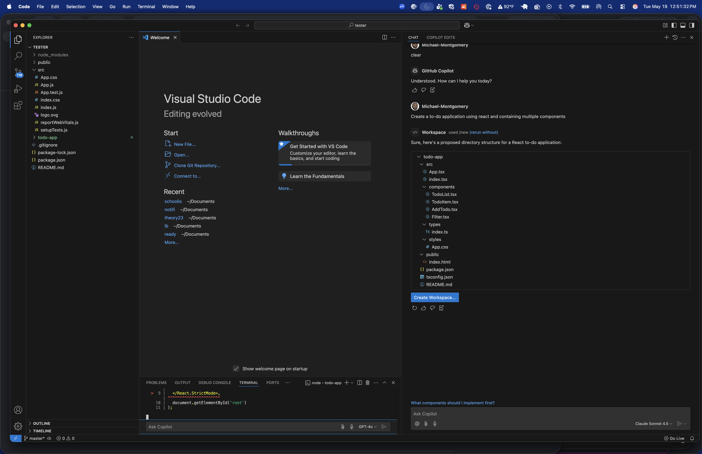
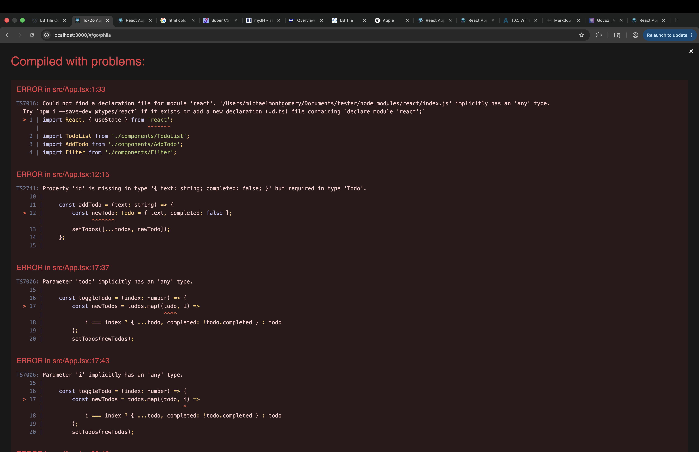
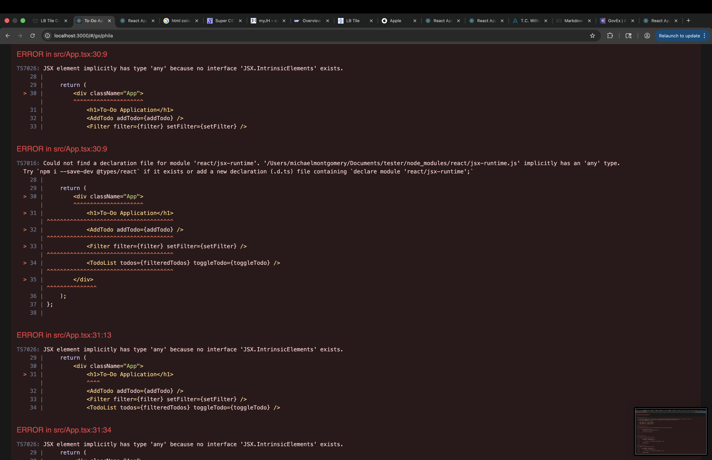
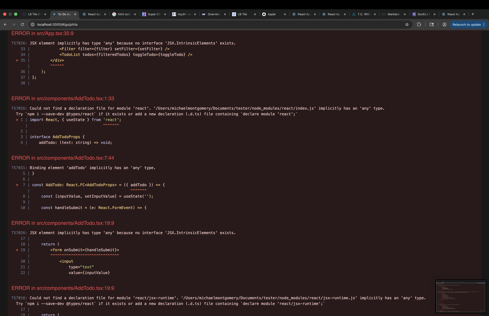


```
As illustrated, in this instance the AI chatbot created an application riddled with error. An application that I, as a senior developer, could create with no errors. In this case using solely AI woould likely create more work than neccessary. AI is a powerful tool, but is most effective in the hands of skilled people who know how to use it, what to look for and how to appropriately and safely text the end result.
```